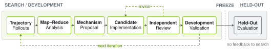
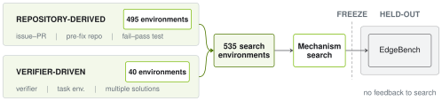
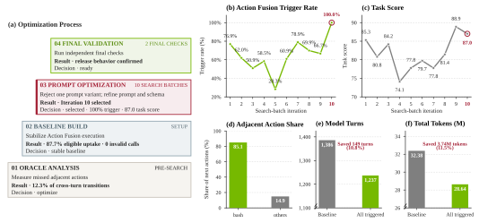
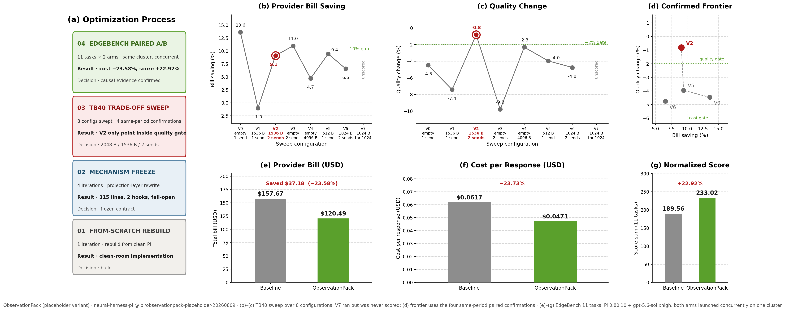
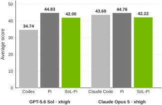
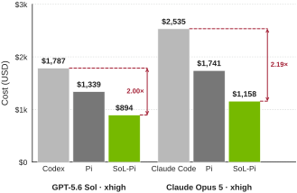
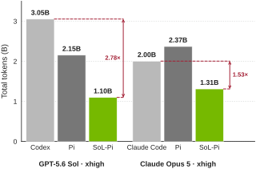
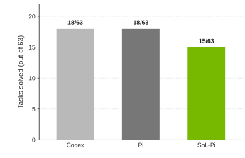
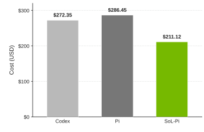
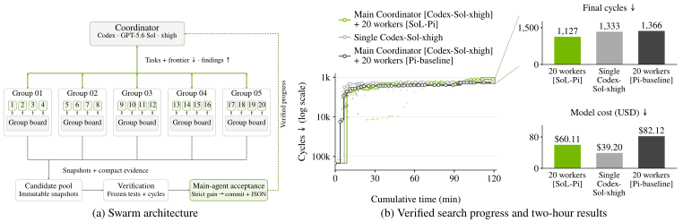

# Blog: SoL-Pi — Scaling Auto-Research Loops for Efficient Agent Harnesses

Source: [nvlabs.github.io/SoL-Pi](https://nvlabs.github.io/SoL-Pi/) · companion project page to
[arXiv 2609.20519](https://arxiv.org/abs/2609.20519) ([paper notes](./index.md), [full text](./paper.md)).
Tagline: *"Spend less without getting less done."*

The page covers the same work as the paper but adds material the paper does not:
the full 152-idea proposal pool, the three orchestration designs the team went
through, and per-mechanism research walkthroughs. Those are the parts worth
reading here.

---

## Introduction

Coding agents moved from completing lines → resolving issues across repositories
→ modifying the tools around them. With modern harnesses, *thousands of agents
can work together continuously for a week without human intervention*. Hence the
framing question: **over an unsupervised run of hours or days, does every token
carry the work forward, or does redundancy grow with trajectory length?**

Recursive self-improvement sharpens this. RSI is itself token-intensive — every
attempt to produce a better system spends tokens whether or not it succeeds. So:
*before scaling RSI, should we first ask AI to make AI more efficient?*

Headline savings for a researcher working a single problem: **$8.75–$13.50/hour**
vs. native Codex and Claude Code, **$4.36–$5.71/hour** vs. Pi (official
API-equivalent pricing; range reflects the model backend).

Closing claim of the section, and the one the authors seem most attached to:
RSI's lasting value "may lie not in any single artifact, but in a search process
that can scale across public environments to discover reusable improvements."

---

## Method

### The proposal pool: 152 ideas → 4 mechanisms

The page renders the entire idea pool as a scrolling marquee, coded by family.
This is the most useful thing on the site that isn't in the paper — it is
effectively a catalogue of harness-design hypotheses, each phrased as a claim.

| Prefix | Family | Count |
|---|---|---|
| `C` | Context | 24 |
| `P` | Progress | 26 |
| `T` | Tools | 26 |
| `D` | Delegation | 15 |
| `R` | Prompt & policy | 15 |
| `M` | Improvement & evaluation | 46 |

Sample entries, to show the flavour:

- **C20** — Detect and repair prompt-cache prefix churn
- **C23 / C24** — Build observation packs before paying for full bodies · Gate ObservationPack by expected lifetime value
- **P6** — Require validation evidence before claiming completion
- **P12** — A static-reading streak is too weak a validation trigger
- **T7** — Do not rely on a passive observation-pressure latch
- **T22** — Design the core surface around `search`, `view`, `edit`, and `run`
- **D6** — Avoid generative edit delegates without a verifier contract
- **R7** — Do not treat blunt brevity or early compaction as a mechanism
- **R12** — Do not use few-shot, RAG, or keyword gates as the primary lever
- **M31** — Prevent proposal examples and private tasks from entering evaluation
- **M35** — Stop when the evidence substrate is invalid

Note the number of *negative* results phrased as ideas (T7, R7, R12, P12, D6,
T6, M-series) — the pool records what was ruled out, not just what was kept.

**The family labels mark where a hypothesis began, not where the mechanism
ended up.** ObservationPack starts in Context as C23/C24 and lands at the
observation boundary.

### Inside one lineage

Seven stages: `Trajectory Rollouts → Map–Reduce Analysis → Proposal →
Implementation → Reviewer → In-Trajectory Validation → Held-Out Validation`.
Reviewer can send work back to Implementation; In-Trajectory Validation can send
it back to Implementation *or* all the way to Trajectory Rollouts. Parallel
across ideas, iterative within each lineage.

Before any rollout budget is spent, **Oracle Analysis** estimates the
opportunity from existing trajectories — a pre-rollout screen so a weak lineage
is rejected cheaply.

The loop is Karpathy's conventional auto-research experiment loop with three
adaptations:

1. Implementation runs as a **Ralph Loop** — iterate until an explicit exit
   condition passes — with a *separate* reviewer checking the implementation and
   its behavioral contract.
2. **Map-reduce analysis** over multiple exploration trajectories: independent
   analyzers per trajectory, then a reducer merges evidence before the next
   proposal.
3. **Two isolated splits.** Develop and screen on train; freeze mechanism *and*
   acceptance rule; then evaluate on held-out. Held-out trajectories never
   re-enter analysis and no agent inside the loop sees held-out results. A
   failed held-out evaluation *rejects* the frozen candidate — it does not
   become feedback for repair or another search episode.

### Three orchestration designs (not in the paper)

The page is candid that orchestrating hundreds of ideas across hundreds of
iterations was the hard engineering problem, and that they got it wrong twice.

| | Design | Where orchestration lives | Advantage | What broke at scale |
|---|---|---|---|---|
| 01 | **Compiled workflow** | YAML compiled to an executable graph, fixed once compiled | Clear handoff, easy collaboration | Fixed graph can't cover every edge case; runs stopped for human repair; operators couldn't reconstruct the context of hundreds of concurrent attempts |
| 02 | **Code orchestration** | Coordination code written by a lead agent, persists across experiments | Runtime flexibility, no fixed graph | The coordinator itself: branches, tests and verification scripts accumulated in a long-lived codebase; launching a new experiment could take **>10 hours of changes** |
| 03 | **Disposable skill loop** | One minimal template; each experiment instantiates a fresh copy and discards it when the run ends | Scaling = repeated template instantiation | The template is a single shared dependency every experiment inherits, so it must be kept correct — still easier than a fixed graph or a growing coordinator |

### Environments

535 executable training environments in two families:

- **495 GitHub issue→PR tasks.** Issue = the task, linked PR = accepted patch and
  change history (the ground-truth trajectory). Repo restored to the commit
  immediately before the fix, dependencies installed in an offline image, PR and
  maintainer regression test withheld. Kept only if the test **fails before** and
  **passes after** the PR.
- **40 verifier-driven synthetic tasks.** Verifier generated first, environment
  built around it, no reference trajectory. Mostly Terminal-Bench-style verifiers.

Explicit anti-leak rule: EdgeBench data and verifiers are not used as sources or
templates for environment synthesis, so the EdgeBench score measures
generalization to unseen task *and verifier* designs.

### The capability floor

Two acceptance gates per loop: every capability metric must stay inside its
predeclared tolerance, **and** at least one efficiency metric must improve. Among
candidates passing the floor, the loop keeps the nondominated results.

> "The gate applies to one mechanism at a time, so the small losses it permits
> can accumulate once mechanisms combine: the assembled harness retains roughly
> 94% of Pi's average score. What the gate rules out is savings that come from
> getting less done."

A cheaper candidate fails if it saves by stopping early, skipping necessary
verification, or removing evidence needed to finish the task.

---

## Discoveries — the four mechanisms

The page maps each mechanism onto a node of the base agent loop
(`Task → Agent → Action → Environment → Observation → Agent ↔ Context Memory`).

### 01 · Action Fusion — *one intent, one turn* (Action / Tools)

Base Pi rollouts showed a recurring sequence: after editing a file, the agent
issues a command to test, build or run the change. Action Fusion applies the edit
and runs the command locally, returning one combined observation — removing the
middle model decision.

How the research agent built it, in four stages:

| Stage | Budget | Result |
|---|---|---|
| 01 Oracle Analysis | pre-search | Adjacent edit/write→command candidates at **12.3%** of cross-turn transitions; Bash was **85.1%** of observed next actions |
| 02 Baseline Build | setup | Execution stabilized at **87.7% uptake** among eligible calls, **zero invalid calls** |
| 03 Prompt Optimization | 10 search batches | Dropped a failed prompt variant, refined prompt + schema; selected **Iteration 10: 100% trigger rate, 87.0 task score** |
| 04 Final Validation | 2 final checks | Independent post-selection checks confirmed release behavior |

Trigger rate ranged **28.3% → 100%** across the ten batches and moved
**non-monotonically** — the page flags the curve as exploratory, not a clean
optimization trace.

Counterfactual (explicitly labelled trajectory-derived, **not a measured rerun**):
had all 149 observed cross-turn candidates triggered, model turns would fall
1,386 → 1,237 (**−10.8%**) and total tokens 32.38M → 28.64M (**−11.5%**).

### 02 · Online Context Compact — *compact at subtask boundaries* (Context)

KV-cache reuse usually pushes compaction late into a run. This mechanism uses a
different clock: decompose the task into subtasks and reconsider compaction
whenever one finishes — but act only when expected future savings repay the
rewrite. Semantic completion becomes the trigger; the cache economics decide
whether the trigger fires.

### 03 · ObservationPack — *preserve access, remove repetition* (Observations)

In base Pi a large file or tool result reappears in every later request,
occupying both context and cache. ObservationPack archives the payload locally,
leaves a handle plus short excerpt in context, and recalls exact pages on demand.

| Stage | Budget | Result |
|---|---|---|
| 01 From-scratch rebuild | 1 iteration | Clean-room reimplementation from clean Pi, replacing the placeholder |
| 02 Mechanism freeze | 4 iterations | Reduced to **315 lines and two hooks**, with a fail-open contract |
| 03 TB40 trade-off sweep | 8 configurations | **V2 was the only configuration inside the quality gate** |
| 04 EdgeBench paired A/B | 11 tasks × 2 arms | Both arms launched concurrently on one cluster |

V2 = **2,048-byte head + 1,536-byte tail + two full sends before projection**.

The paired run: response count changed by only **0.20%**, which attributes the
saving to *cheaper responses* rather than fewer of them. Result: provider bill
**−23.58%**, cost per response **−23.73%**, normalized score **+22.92%**.

### 04 · Evidence-Preserving Reducer — *delegate reading, verify evidence* (Delegation)

In build and test trajectories only a few lines of a long log change the next
decision. The first reading is delegated to a cheaper agent; the resulting
receipt is **bound to the archived log and every quoted line is verified** before
the frontier agent sees it.

> "Delegation no longer requires trust in a fluent summary."

---

## Results

All comparisons ran each backend at **xhigh**, the highest reasoning-effort
setting in the evaluation.

### EdgeBench

| | | |
|---|---|---|
|  |  |  |

- Retains **~94%** of Pi's average score on both backends; with GPT-5.6 Sol it
  **exceeds** the model's native Codex harness.
- vs. **Pi**: 45–49% fewer tokens, ~one third lower cost.
- vs. **model-native harnesses**: 35–64% fewer tokens, list-price API cost 50–54% lower.

### Terminal-Bench 4 — 63 CPU-only tasks

| | |
|---|---|
|  |  |

| Harness | Solved / 63 | Total API-equivalent cost |
|---|---|---|
| Codex | 18 | $272.35 |
| Pi | 18 | $286.45 |
| **SoL-Pi** | **15** | **$211.12** |

Both charts start their vertical axis at zero — the page says so explicitly.

---

## Efficient agent swarm

Task: **Anthropic's original performance take-home**, a kernel-optimization
problem scored in simulated machine cycles. One **GPT-5.6 Sol coordinator**
running in Codex directs **20 GPT-5.6 Luna workers**, all at xhigh, arranged in
five groups of four with independent workspaces and a local evidence board.
SoL-Pi vs. Pi as the *worker* harness; Codex coordinates in both conditions.

Exchange rules: workers ask group peers to reproduce or combine promising
findings; the coordinator passes compact insights between groups and keeps some
workers exploring alternatives. A shared best result advances **only when the
coordinator requests acceptance and an independent check confirms a strict
improvement**.

Three independent two-hour trials from the same frozen starter, fresh sessions,
no carry-over of previous runs' solutions or notes (the two controls ran
sequentially, single-agent first):

| Configuration | Cycles ↓ | Model cost ↓ | Speed thresholds |
|---|---|---|---|
| **Sol + 20 SoL-Pi** | **1,127** | **$60.11** | 8/8 |
| Single Sol | 1,333 | $39.20 | 8/8 |
| Sol + 20 Pi | 1,366 | $82.12 | 7/8 |

**17.5% fewer cycles and 26.8% lower cost** than the Pi swarm. Single-agent Sol
is still the cheapest condition — the swarm buys a better frontier, not a
cheaper bill.

> "A useful swarm shares evidence, not every thought." Independent trajectories
> create alternative hypotheses; bounded communication makes useful findings
> reusable; verification decides what the group keeps.

---

## Discussion

**Token efficiency favors reusable improvements.** Optimizing a harness on a
closed task set is an easy path to benchmark overfitting — a search loop can move
task-related information into the harness or add rules for patterns recurring in
the training tasks, and the score improves even when the change stops working
outside that set. Token efficiency points the search at work that recurs *across*
tasks (repeated context, actions needing no intermediate decision, retransmitted
tool outputs), which doesn't depend on knowing any particular answer. Hence the
capability floor: token savings count only when task quality stays in range.

**Why EdgeBench.** It was the only public benchmark they could find that
consistently supported **2–12 hours** of continuous reasoning and tool use.
Terminal-Bench 2.1 and SWE-bench usually finish within an hour, and on short
tasks context replay, large tool outputs, cache writes and extra model turns have
no time to accumulate — per-turn savings get hidden by startup cost and
task-to-task variance.

**Breadth escapes local search basins.** DFS keeps one lineage alive and refines
its latest candidate; BFS expands many independent ideas, then gives each
promising branch a loop. Observed qualitatively: after roughly **five to ten
iterations**, even GPT-5.6 Sol at xhigh got stuck in a local basin, making
smaller adjustments to the same design rather than changing direction. BFS
behaved differently — most ideas failed validation, but idea diversity
occasionally exposed an unusual candidate a later loop could harden, and *those
jumps produced some of the most useful harness changes in the project*.
Conversion rate: **~1 in 40 starting ideas survived validation.**

**Two conditions for generalization:** a diverse idea pool from broad search, and
robust validation where evaluation environments are fully isolated from
search/training and reflect real deployment variation and failure modes. Without
both, auto-research improves performance in one environment without improving the
system beyond it.

**Humans set priors and inspect survivors.** SoL-Pi is a *hybrid* auto-research
loop. Humans supplied early priors about harness principles and filtered out
low-value directions (e.g. searches over base-harness hyperparameters) before
scaling the pool. Once an idea entered a loop, the loop ran unattended through
research and validation. When a candidate survived, humans came back to
understand the discovered mechanism and refactor it into a clean implementation.

The authors leave the end state open: in an open-ended loop, "drift in goals,
evidence, or implementation can compound before humans notice it, and the
consequences may be difficult to reverse." Where should people provide priors,
gate the search budget, review accepted changes, clean up implementations — and
where should they step back?

**Pretraining the harness.** A preliminary closed loop already ran: agents
gathered or synthesized tasks, built executable environments, collected
trajectories, validated candidates, and updated their own harness. The
expectation is *a scaling law for harnesses* analogous to model scaling laws — as
compute and rollout-environment diversity grow, harnesses become more capable,
robust and efficient. Early stage.

---

## Recursive Efficient Improvement (REI)

The page's closing idea, and the one to keep clearly labelled as a **vision, not
a result**:

> "Efficiency may also become recursive: a more efficient harness could lower the
> cost of the auto-research used to build its successor. […] a more efficient
> harness may help discover an even more efficient one. We call this possibility
> **recursive efficient improvement**; it is a long-term research vision rather
> than a compounding effect demonstrated by the present study."

The plan is to use SoL-Pi as the starting harness for the next research cycle, so
that a fixed budget covers more environments, trajectories and ideas.

---

## Delta vs. the paper notes

Things on the page that the [index notes](./index.md) don't already capture:

- The full **152-idea pool** with per-family counts, including the negative
  results (what was ruled out and why the phrasing is falsifiable).
- The **three orchestration designs** and the >10-hour-per-experiment failure of
  the code-orchestration approach.
- **Per-mechanism research walkthroughs** with the actual search numbers —
  Action Fusion's 12.3% oracle estimate and non-monotonic 28.3→100% trigger
  curve; ObservationPack's 315-lines/two-hooks freeze, 8-config sweep, and the
  0.20% response-count delta in the paired A/B.
- The **~1-in-40 conversion rate** and the 5–10-iteration local-basin observation.
- **Why EdgeBench specifically** — the 2–12 hour horizon as a measurement
  requirement, not a preference.
- Terminal-Bench 4 **Codex cost ($272.35)**, which the paper notes omit.
- REI stated in the authors' own words, with its own hedge attached.

---

*Captured from the live page on 2026-09-21 (page build `SIGIL · d179e73d`). Figures
mirrored under [images/blog/](./images/blog/) — see [images/README.md](./images/README.md)
for the `curl` commands that reproduce them.*
